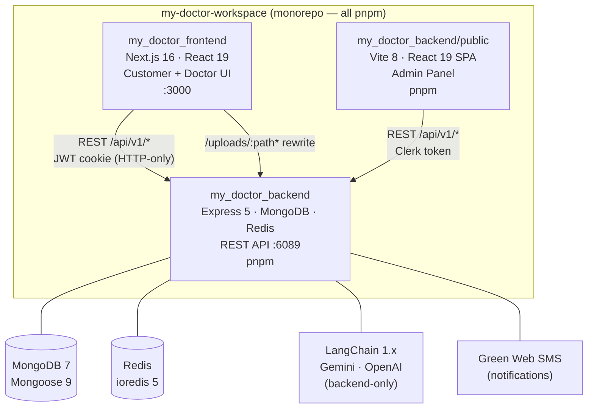
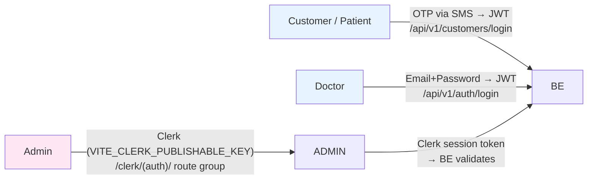

# Architecture Spine — My Doctor Platform

## Paradigm

**Multi-app monorepo, layered modular backend.**

Three independent deployment units share one git workspace. Each unit has its own `package.json`, build pipeline (all use **pnpm**), and auth system. No shared runtime; no cross-unit imports at build time. The backend is a domain-modular Express 5 REST API (MongoDB + Redis). The frontend is a Next.js 16 App Router consumer. The admin panel is a Vite 8 React SPA embedded physically inside the backend repo, built and deployed independently, served as static files from `public/dist/`.

---

## System Map



---

## Auth Boundary Map



---

## Architecture Decisions

### AD-1 Multi-App Monorepo [ADOPTED]

**Binds:** Three units share one git workspace but are fully independent at runtime:

| Unit | Path | Package manager | Build output |
|------|------|-----------------|--------------|
| Patient Frontend | `my_doctor_frontend/` | pnpm | Next.js server |
| API Backend | `my_doctor_backend/` | pnpm | `dist/` (tsc ESM) |
| Admin Panel | `my_doctor_backend/public/` | pnpm | `public/dist/` (Vite) |

**Prevents:** Cross-unit imports; shared dependency version drift; `node_modules` collisions.

**Rule:** No import across unit boundaries. Each unit installs its own deps. `my_doctor_backend/public/dist/` is committed (Express serves it statically) — built separately, never imported.

---

### AD-2 Three-Actor Auth Isolation [ADOPTED]

**Binds:** Each actor has exactly one auth path — never shared, never interchangeable:

| Actor | Mechanism | Token storage | Entry |
|-------|-----------|---------------|-------|
| Customer / Patient | OTP (SMS) → JWT access + refresh | HTTP-only cookie | `POST /api/v1/customers/login` |
| Doctor | Email + bcrypt → JWT access + refresh | HTTP-only cookie | `POST /api/v1/auth/login` |
| Admin | Clerk (`@clerk/clerk-react` ^5.61.3) | Clerk-managed | `/clerk/(auth)/` route group |

**Prevents:** JWT cross-use between customer and doctor; Admin calling Customer/Doctor-protected endpoints with a Clerk token; auth mechanism proliferation.

**Rule:** Backend protected routes always apply `verifyAccessToken` (decode) then `protect` (role check) in that order. Admin panel uses `useAuth()`/`useUser()` from `@clerk/clerk-react` exclusively — never custom JWT. Customer OTP codes stored in `Otps` collection; expire on use.

---

### AD-3 API Response Envelope [ADOPTED]

**Binds:** Every backend HTTP response uses the `sendResponse` utility:

```ts
{ success: boolean, message?: string, data: T, meta?: object }
```

**Prevents:** Inconsistent shapes breaking frontend `ApiResponse<T>` typing; direct `res.json()` bypassing the contract; per-controller error handling divergence.

**Rule:** Controllers call `sendResponse`. Errors pass to `next(error)` for the centralized error handler — no catch-and-swallow. Frontend types all responses as `ApiResponse<T>` from `src/types/api.type.ts`.

---

### AD-4 Adapter Boundary (Frontend) [ADOPTED]

**Binds:** Raw API response shapes (with `_id` MongoDB ObjectIds) must never reach React components. `src/adapters/` contains one adapter per domain entity mapping `_id → id` and normalizing to the frontend type.

**Prevents:** MongoDB ObjectId strings in component props; backend schema changes silently breaking component contracts; `_id` referenced in JSX.

**Rule:** All API response data passes through the domain adapter before entering TanStack Query cache, Redux state, or any component prop. Current adapters: ambulance, diagnostic, doctor, guide, home-doctor, hospital, prescription, queue, specialty.

---

### AD-5 Frontend State Ownership [ADOPTED]

Four distinct state layers, each with a single owner:

| Layer | Owner | Scope |
|-------|-------|-------|
| Global UI + auth | Redux RTK (`app` slice, `auth` slice) | sidebar state; current user/token |
| Server data | TanStack Query v5 (`staleTime: 60000`) | all fetched/cached API data |
| URL-reflected params | nuqs v2 | filters, pagination, search terms |
| Ephemeral UI | local `useState` | modals, form steps, toggles |

**Prevents:** Two owners of the same server data; auth token in `localStorage`; `useEffect`+`useState` server-fetch anti-pattern; URL state lost on navigation.

**Rule:** Use `useAppDispatch()`/`useAppSelector()` from `src/redux/hooks.ts` — never raw `useDispatch`/`useSelector`. Auth state hydrated from cookies in `AuthProvider` — never read cookies in components. No `useEffect`+`useState` data-fetch pattern; use React Query mutations and queries.

---

### AD-6 Admin Panel Isolation [ADOPTED]

**Binds:** Admin panel is a fully independent Vite 8 SPA in `my_doctor_backend/public/`. State: Zustand 5 only (not Redux). Routing: TanStack Router v1 file-based; `routeTree.gen.ts` is auto-generated. Auth: Clerk exclusively.

**Prevents:** Redux dependency bleeding from frontend; manual edits to `routeTree.gen.ts`; npm/yarn use in admin panel.

**Rule:** Feature UIs live in `src/features/<domain>/`; route files import from features and stay thin. `routeTree.gen.ts` — never edit manually. Admin is built with `pnpm build`, output committed to `public/dist/`, served by Express:
```ts
app.use(express.static(path.join(__dirname, '../public/dist')));
```

---

### AD-7 Backend Module Structure [ADOPTED]

**Binds:** Every domain module has exactly 4 files:

```
src/modules/<domain>/
├── <Domain>.controller.ts   ← request/response handlers
├── <Domain>.model.ts        ← Mongoose schema + model
├── <Domain>.routes.ts       ← Express Router
└── <Domain>.service.ts      ← business logic
```

File naming: PascalCase matching domain (e.g. `Doctors.controller.ts`). ESM: all local imports include `.js` extension even for `.ts` source.

**Prevents:** Password hashing in service layer (pre-save Mongoose hook owns it); extra files fragmenting domain logic; `ERR_MODULE_NOT_FOUND` from missing `.js` extensions.

**Rule:** New domains register routes in `src/routes/routes.ts`. Mongoose queries that don't need document methods use `.lean()`. All routes mount under `/api/v1/`.

---

### AD-8 Asset Pipeline [ADOPTED]

**Binds:** User file uploads stored at `/uploads/` on disk via Multer 2. Backend serves them at `http://localhost:6089/uploads/`. Next.js `next.config.ts` rewrites `/uploads/:path*` → `http://localhost:6089/uploads/:path*`.

**Prevents:** Hardcoded backend host in frontend component URLs; user files served from `src/`.

**Rule:** Frontend always uses relative `/uploads/<filename>` paths — never absolute backend host. Never serve uploads from the Next.js source tree.

---

### AD-9 Frontend Feature Gate [ADOPTED]

**Binds:** All primary frontend routes are registered in `src/config/features.ts` `PAGE_FEATURES` map with `enabled: boolean`. `proxy.ts` middleware blocks requests to routes where `enabled: false`.

**Prevents:** Unintegrated pages deployed and reachable; routes going live without explicit activation.

**Rule:** Every new primary route added to `PAGE_FEATURES` before merging. Disabled routes carry `launchDate` for tracking.

---

### AD-10 Config Centralization [ADOPTED]

**Binds:** All API endpoint strings live in `src/config/api.ts` → `API.ENDPOINTS`. All cookie/storage key strings live in `src/config/constant.ts` → `CONSTANT.LOCAL_STORAGE_KEYS`. Image remote domains whitelisted in `next.config.ts`.

**Prevents:** Hardcoded URL paths or cookie key strings scattered across components and services.

**Rule:** No string literals for API paths or auth cookie keys outside config files. New endpoints appended to `API.ENDPOINTS`; new key names appended to `CONSTANT.LOCAL_STORAGE_KEYS`.

---

### AD-11 AI Integration Boundary [ADOPTED]

**Binds:** All LangChain / LLM logic lives exclusively in the backend. No LLM SDK imports in frontend or admin. AI features expose standard REST endpoints like any other module.

**Prevents:** LLM API keys leaking to the browser; duplicated LangChain instances; frontend coupling to agent internals.

**Rule:** AI agents (LangGraph stateful agents, LangChain chains) are invoked only from backend service files. Frontend calls `/api/v1/<ai-route>` like any other endpoint. Current AI stack: `langchain` ^1.3, `@langchain/langgraph` ^1.2, `@langchain/google-genai` ^2.1, `@langchain/openai` ^1.4, `@langchain/mongodb` ^1.1 (vector store), `@langchain/community` ^1.1.

---

## Deferred

| Item | Deferred because |
|------|-----------------|
| WebSocket / real-time push | Live queue uses polling today. Revisit when push latency requirements are confirmed. |
| Mobile app | Not present in workspace. Architecture extends here when it lands. |
| LangChain agent contracts | Agent boundaries, vector store schema, prompt versioning — owned by AI feature work, not the platform spine. |
| E2E / frontend test strategy | No test framework configured for frontend or admin. Revisit when a framework decision is made. |
| Deployment topology | Dev: nodemon + Next.js dev + Vite dev. Prod: PM2 cluster + compiled `dist/`. Infra provider, CDN, env promotion strategy not yet fixed. |
| Redis caching contracts | Patterns exist in backend but not formally specified. Revisit when cache invalidation bugs surface. |
| Admin → Backend auth verification | How backend validates Clerk tokens server-side is not confirmed in code scan. Revisit before admin protected endpoints go live. |

---

## Seed

### Directory Tree

```
my-doctor-workspace/
├── my_doctor_frontend/              # Next.js 16 · React 19 · pnpm
│   └── src/
│       ├── adapters/                # Domain adapters (BackendT → T)
│       ├── app/                     # App Router pages
│       │   ├── (auth)/              # sign-in, sign-up, doctor-sign-in, onboarding
│       │   ├── (dashboard)/         # Doctor + Patient dashboards
│       │   │   └── auth.config.ts   # auth rules per route group
│       │   ├── (primary)/           # Public-facing pages
│       │   └── (secondary)/         # Supporting pages
│       ├── components/
│       │   ├── ui/                  # shadcn/ui primitives only
│       │   ├── common/              # Navbar, Footer, Breadcrumb
│       │   ├── cards/               # DoctorCard, HospitalCard, etc.
│       │   └── sections/            # HeroSection, FeaturesSection, etc.
│       ├── config/                  # api.ts · constant.ts · features.ts · env.ts
│       ├── redux/                   # app + auth slices; typed hooks
│       ├── services/                # TanStack Query hooks per domain
│       └── lib/api.ts               # Axios instance + interceptors
│
├── my_doctor_backend/               # Express 5 · pnpm · port 6089
│   ├── src/
│   │   ├── modules/<domain>/        # *.controller.ts *.model.ts *.routes.ts *.service.ts
│   │   ├── routes/routes.ts         # Central route registry → /api/v1/*
│   │   ├── middlewares/             # verifyAccessToken, protect, error handler
│   │   ├── database/                # MongoDB + Redis init
│   │   └── utils/                   # sendResponse, logger, errorResponse
│   ├── uploads/                     # Multer upload target (served statically)
│   └── public/                      # Admin SPA (pnpm, Vite 8)
│       └── src/
│           ├── features/<domain>/   # Feature UI modules
│           ├── routes/              # TanStack Router file-based
│           │   └── clerk/(auth)/    # Clerk sign-in/sign-up routes
│           ├── stores/              # Zustand 5 stores (auth-store, etc.)
│           └── routeTree.gen.ts     # AUTO-GENERATED — never edit manually
```

### Domain Inventory (backend modules, all follow AD-7)

Ambulances · AmbulanceBookings · Appointments · BdLocations · CallbackRequests · Cities · Concentrations · ContactMessages · Customers (+ Otps) · DiagnosticBookings · DiagnosticTests · DoctorHomeSchedules · DoctorLiveQueues · DoctorReviews · Doctors · DoctorSchedules · Guides · GuideBookings · HomeDoctorBookings · Hospitals · Labs · Prescriptions · SmsLogs · Specialities · Users (+ Analytics)

### Environment Variables (canonical)

**Frontend (`my_doctor_frontend/`)**

| Variable | Purpose |
|----------|---------|
| `NEXT_PUBLIC_API_URL` | Backend REST API base URL |
| `NEXT_PUBLIC_APP_URL` | Application base URL |
| `NEXT_PUBLIC_ASSETS_URL` | Media/document CDN or backend URL |
| `NEXT_PUBLIC_FIREBASE_API_KEY` | Firebase project key (Google OAuth) |
| `NEXT_PUBLIC_ENABLE_ANALYTICS` | Feature toggle |
| `NEXT_PUBLIC_ENABLE_MAINTENANCE_MODE` | Feature toggle |
| `NEXT_PUBLIC_WHATSAPP_NUMBER` | Support WhatsApp contact |
| `NEXT_PUBLIC_CONTACT_PHONE` | Support phone number |

**Backend (`my_doctor_backend/`)**

| Variable | Purpose |
|----------|---------|
| `MONGODB_URI` | MongoDB connection string |
| `DB_NAME` | Database name |
| `SESSION_SECRET` | express-session signing secret |
| `ACCESS_TOKEN_SECRET` | JWT access token signing secret |
| `REFRESH_TOKEN_SECRET` | JWT refresh token signing secret |
| `PORT` | HTTP server port (default 6089) |
| `GREEN_WEB_KEY` | Green Web SMS gateway API key |
| `GEMINI_API_KEY` | Google Gemini LLM key |
| `OPENAI_API_KEY` | OpenAI LLM key (optional fallback) |
| `BRAVE_SEARCH_API_KEY` | Brave Search for AI agent flows |

**Admin (`my_doctor_backend/public/`)**

| Variable | Purpose |
|----------|---------|
| `VITE_API_URL` | Backend REST API base URL |
| `VITE_CLERK_PUBLISHABLE_KEY` | Clerk publishable key |

### Active Frontend Routes (enabled in PAGE_FEATURES)

`/` · `/doctors` · `/hospitals` · `/ambulances` · `/telemedicine` · `/specializations` · `/search` · `/diagnostics` · `/diagnostic-labs` · `/guides`
