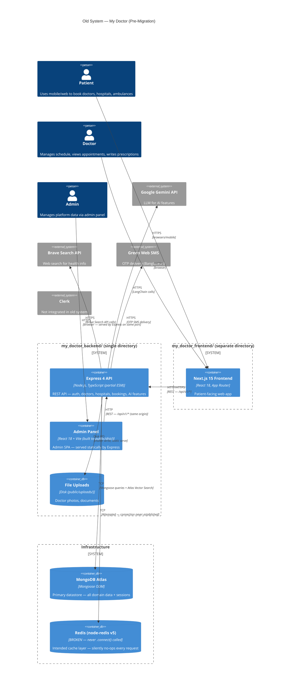
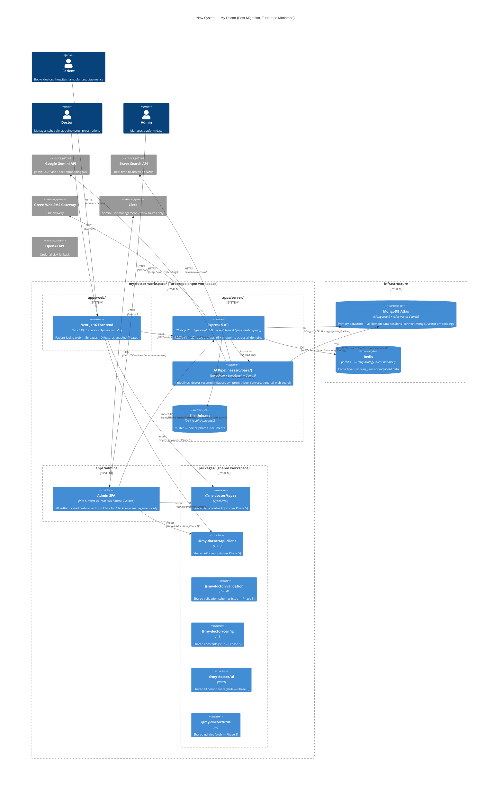
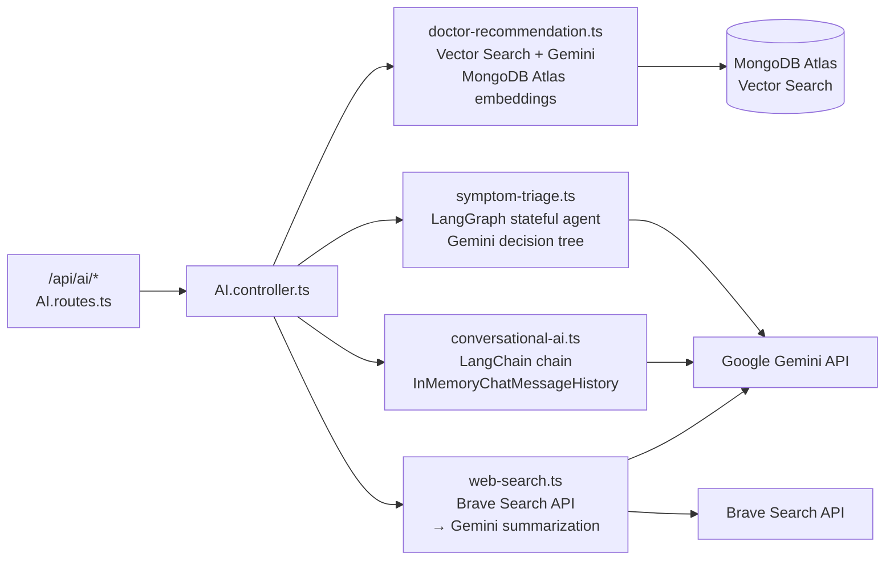
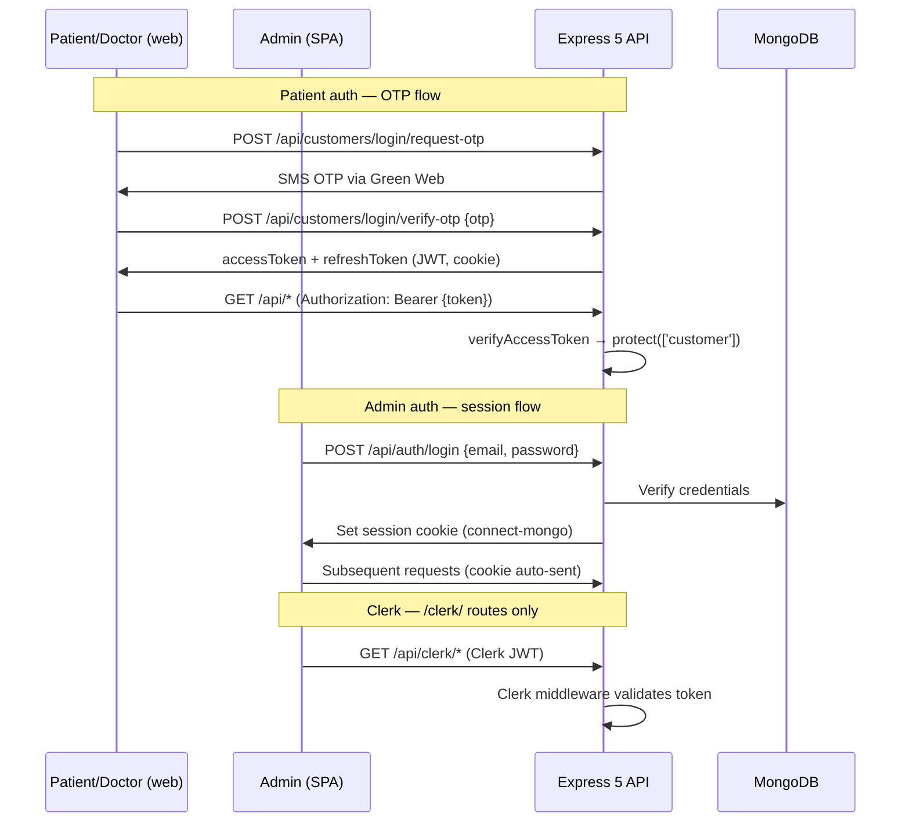

# My Doctor — System Design

> Container-level system designs for both the pre-migration and post-migration architectures.
> Generated from live codebase inventory (2026-06-30). Diagrams are Mermaid — render in GitHub, VS Code, or any Mermaid viewer.

---

## Old System Design (Pre-Migration)

Two independent directory trees with no workspace linking. Admin panel source code co-located inside the backend directory. Redis initialized but never actually connected. Environment loading scattered and order-dependent.

### Architecture Diagram



### Deployment Topology

```
Single server (or VM):
  └── Node.js process (pm2)
        ├── Serves REST API on :5000
        ├── Serves admin SPA from public/dist/ (static)
        └── Serves uploads from public/uploads/ (static)

  Separate server (or Vercel):
  └── Next.js process
        └── Serves patient frontend on :3000

  MongoDB Atlas (cloud)
  Redis (local — never actually connected)
```

### Known Structural Defects

| Defect | Impact |
|--------|--------|
| `redis` package used with v2/v3-style config wrapped in `as any` | Cache layer silently no-ops — every request hits MongoDB. `setEx` (camelCase, node-redis v4 API) called on a client that never connected |
| `dotenv.config()` called in `app.ts`, `logger.ts`, and `init_redis.ts` independently | ESM depth-first import evaluation → `process.env` can be empty when modules initialize. Intermittent startup failures |
| Admin source lives in `my_doctor_backend/public/src/` | Redeploying admin UI requires rebuilding and restarting the backend process |
| No workspace linking between frontend and backend | Types copy-pasted or inferred as `any` across apps. No shared contracts |
| `__dirname` used in ESM context | `undefined` in ESM → wrong file resolution paths for uploads and admin dist |
| Zombie packages installed | `langchain` (meta-package), `@langchain/community` (deprecated), `cheerio`, `express-winston` — all installed, none imported |
| No env validation | Missing required vars produce silent `undefined` at runtime, not a startup error |

### Old Middleware Stack (`app.ts`)

```
express.json()
express.urlencoded()
cors()
helmet()
morgan()
express.static('/uploads')
express.static('public/dist')     ← admin SPA
cookie-parser
compression
express-session  (connect-mongo)
app.use("/api", routes)           ← no rate limiting
SPA fallback
Global error handler
```

**Missing from old stack:** `hpp` (HTTP parameter pollution), `express-rate-limit` on the API prefix, env validation before any of this runs.

---

## New System Design (Post-Migration)

Turborepo monorepo with three independent apps and six shared workspace packages. Redis replaced with ioredis (working). Environment validated with Zod at process entry. Admin extracted to own app with independent build pipeline. Security middleware hardened with `hpp`.

### Architecture Diagram



### Deployment Topology

```
Turborepo build (pnpm run build from workspace root):
  1. packages/* — built first (dependency order enforced by turbo.json)
  2. apps/admin — tsc -b && vite build → dist/ (575ms, cached by Turborepo)
  3. apps/server — tsc → dist/         (parallel with admin)
  4. apps/web   — next build            (parallel, depends on packages)

Production:
  ┌─────────────────────────────────────────┐
  │  Server (VPS / container)               │
  │  ├── pm2 cluster: node dist/app.js      │
  │  │     ├── REST API on :6089            │
  │  │     ├── Static: /uploads             │
  │  │     └── Static: apps/admin/dist/     │← admin SPA served by Express
  │  └── (optional) Nginx reverse proxy     │
  └─────────────────────────────────────────┘

  ┌─────────────────────────────────────────┐
  │  Separate server or Vercel Edge         │
  │  └── Next.js standalone: apps/web       │
  └─────────────────────────────────────────┘

  MongoDB Atlas (cloud, M0/M10+)
  Redis (local or managed — ioredis connects, retries on failure)
```

### New Middleware Stack (`app.ts`) — Exact Order

```
1.  express-status-monitor   — /status dashboard
2.  express.json()
3.  express.urlencoded({ extended: true })
4.  hpp()                    — HTTP parameter pollution prevention (after body parsing)
5.  cors()                   — allowlist: FRONTEND_URL + ADMIN_URL, credentials: true
6.  helmet()                 — crossOriginResourcePolicy/CSP/COEP disabled for upload serving
7.  morgan('dev')
8.  express.static('/uploads') — public/uploads/
9.  express.static(admin_dist) — apps/admin/dist/
10. cookie-parser
11. compression
12. express-session           — connect-mongo store, 24h, httpOnly, sameSite lax
13. app.use("/api", apiLimiter, routes)  — rate-limiter guards all API routes
14. SPA fallback GET /.*/    — serves admin index.html, skips /api paths
15. Global error handler     — ErrorRequestHandler using errorResponse()
```

### Backend Domain Map — 27 Modules

```
Auth & Users        /auth, /customers (OTP login), /users (admin)
Doctors             /doctors, /doctor-schedules, /doctor-home-schedules,
                    /doctor-live-queues, /doctor-reviews
Hospitals           /hospitals
Ambulances          /ambulances, /ambulance-bookings
Diagnostics         /diagnostic-tests, /labs, /diagnostic-bookings
Bookings            /appointments, /guide-bookings, /home-doctor-bookings
Content             /guides, /specialities, /concentrations, /bd-locations
Comms               /contact-messages, /callback-requests, /sms-logs
Medical             /prescriptions
AI                  /ai  (routes to src/base/ pipelines)
Ops                 /health, /analytics

Dead module:        cities/ (directory exists, no route registered)
```

### AI Layer — `src/base/` Pipelines



### Auth Flow — Two Mechanisms



### Frontend — Feature Gate

All primary routes are registered in `apps/web/src/config/features.ts`. Middleware (`middleware.ts`) checks `PAGE_FEATURES[path].enabled` before rendering.

```
Enabled  (10): /  /doctors  /hospitals  /ambulances  /telemedicine
               /specializations  /search  /diagnostics  /diagnostic-labs  /guides

Disabled  (7): /nurses  /diagnostic-home-services  /health-checkup-services
               /domiciliary-services  /pharmacy  /offers  /nursing-home-service
               → Middleware intercepts → renders coming-soon page automatically
```

---

## Design Comparison

| Dimension | Old System | New System |
|-----------|-----------|-----------|
| **Repo structure** | 2 separate dirs, no linking | Turborepo monorepo, pnpm workspace |
| **Admin coupling** | Source inside `my_doctor_backend/public/` | Independent `apps/admin/` with own build |
| **Cache layer** | node-redis — never connected, silently no-ops | ioredis — working, retryStrategy, event handlers |
| **Env loading** | `dotenv.config()` scattered, order-dependent | `import "./config/env.js"` first line — Zod validates, exits on error |
| **HTTP status** | Magic numbers (400, 401, 404, 500) | `StatusCodes.*` named constants |
| **Security middleware** | `helmet + cors` | `hpp + helmet + cors + rate-limit` |
| **Dev server** | `nodemon + ts-node` — slow restarts | `tsx watch` — fast, correct ESM |
| **Build pipeline** | Manual per-directory | Turborepo — parallel, cached, dependency-ordered |
| **Shared packages** | None — types duplicated or `any` | 6 workspace packages (stub, Phase 5 to populate) |
| **AI packages** | `langchain` (deprecated meta) + `@langchain/community` (deprecated) | Individual `@langchain/*` packages only |
| **Auth — patients** | JWT (same) | JWT (same) |
| **Auth — admin** | express-session | express-session + Clerk for `/clerk/` only |
| **`__dirname`** | `fileURLToPath(import.meta.url)` or undefined | `import.meta.dirname` (Node.js 20.11+) |
| **Node built-ins** | `import path from 'path'` | `import path from 'node:path'` |
| **Type safety** | Partial — `any` in service layer | Partial — `any` remains in service layer (Phase 6) |
| **Dead code** | Multiple zombie packages | `cities` module (no route); 7 disabled page features |
| **Build output** | Not coordinated | All 3 apps pass `pnpm run build` clean |

---

## What Isn't Done Yet

| Phase | Work |
|-------|------|
| Phase 5 | Populate `packages/*` — extract shared types, API client, Zod schemas from web + admin |
| Phase 6 | Replace `any` in service layer, Knip dead code audit, `cities` module decision, Biome strict rules |
| Phase 7 | ARCHITECTURE.md, DEPLOYMENT.md, API.md, GitNexus re-index post Phase 5 |
| CI/CD | `.github/workflows/` is empty — no automated build/typecheck on PR |
| Indexes | MongoDB Atlas Vector Search indexes created manually, not in code |
